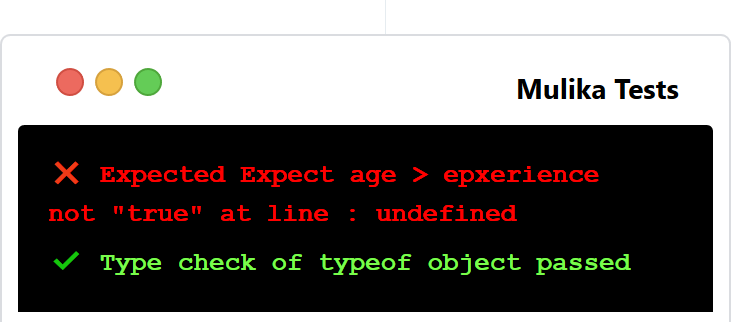

## Mulika, Tiniest JavaScript Test Tool

### Install mulika

```bash
npm i mulika 
```

### Mulika CDN
Minimal in-browser UI add-on to your pages! 



#### Add the scripts 
Above any files to be tested in your html page.

```js
   <script src="https://pwafire.org/code/mulika/@latest.js"></script>
```

#### Add styles to your page

```html
 <link rel="stylesheet" href="https://pwafire.org/code/mulika/@latest.css" />
```

### Specification...

All variables must be provided, all are required!

```js
// Type check...
mulika.typeCheck({ type: type, value: value });

// Other tests...
mulika.expect(message, func, expected_value);
```

### Example...

Launch Playground [Here](https://npm.runkit.com/mulika)

```js
// Require mulika...
const mulika = require("mulika");

const registered = true;
// 1. Type check...
mulika.typeCheck({ type: "boolean", value: registered });

// 2. All tests...
mulika.expect("Sum to be 1", add(1, 9), 1);
// Function to test...
function add(a, b) {
    return a + b;
}
```

Enjoy!
